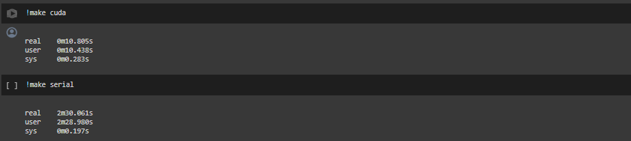

# 🔢📈 Tugas Kecil 3 - Paralel Invers Matrix dengan CUDA
> Tugas Kecil 3 IF3230 Sistem Paralel dan Terdistribusi, Melakukan Paralelisasi Invers Matrix Metode Gauss-Jordan dengan CUDA.

## ❓ &nbsp;Apa itu CUDA?
CUDA (*Compute Unified Device Architecture*) adalah sebuah platform dan API yang dikembangkan oleh NVIDIA untuk memungkinkan penggunaan unit pemrosesan grafis (GPU) untuk pemrosesan selain grafis. CUDA memberikan pengembang kemampuan untuk memanfaatkan GPU untuk komputasi berkinerja tinggi (HPC) dan komputasi paralel di aplikasi yang berbeda-beda, seperti simulasi, analisis data, dan pembelajaran mesin. Secara khusus, CUDA menyediakan perangkat lunak dengan cara langsung untuk mengirimkan perintah ke GPU, tidak hanya untuk *rendering* grafis, tetapi juga untuk melakukan perhitungan kompleks secara paralel. Implementasi ini memanfaatkan ribuan *core* pada GPU modern untuk melakukan operasi matematika yang sangat efisien dan lebih cepat dibandingkan dengan CPU biasa untuk tugas-tugas tertentu. CUDA juga mendukung berbagai bahasa pemrograman, termasuk C, C++, dan Fortran, serta berbagai pustaka yang memudahkan pengembangan perangkat lunak yang berorientasi pada performa tinggi.

## 🤔 &nbsp;Bagaimana Implementasinya dalam Invers Matrix?
Prosedur inversi matriks menggunakan CUDA memanfaatkan kemampuan pemrosesan paralel GPU untuk meningkatkan efisiensi secara signifikan. Implementasi ini terutama menggunakan teknik eliminasi Gauss untuk mengubah matriks menjadi bentuk eselon tereduksi, yang kemudian diikuti oleh normalisasi untuk membentuk matriks identitas. Di samping matriks identitas tersebut terletak invers dari matriks asli. Seluruh proses ini dapat dilakukan dengan cepat berkat alokasi dan distribusi thread yang efisien. Setiap thread bertanggung jawab atas perhitungan yang diperlukan pada baris tertentu. Tahapan awal melibatkan penggunaan Kernel CUDA untuk eliminasi Gauss, yang mengurangi elemen di bawah pivot menjadi nol dengan mengurangi kelipatan baris pivot dari baris lain. Ini diikuti oleh `reduce_to_unit_kernel` di kernel kedua, yang mengubah matriks di sebelah kiri menjadi matriks identitas dan matriks di sebelah kanan menjadi matriks invers. Proses ini diakhiri dengan sinkronisasi dan pemindahan hasil dari GPU ke CPU.

## 💡 &nbsp;Detail Prosedur Implementasi
1. Terima masukan sebuah matriks berukuran $n \times n$ dan inisiasi pula matriks identitas $n \times n$ di sisi kanannya. Hasil akhir yang terbentuk adalah sebuah matriks berukuran $n \times 2n$. Prosedur ini dilakukan di memori host (CPU).
2. Pengguna memasukkan nilai-nilai untuk matriks $n \times n$. Setiap nilai dimasukkan ke dalam bagian kiri matriks besar yang berukuran $n \times 2n$. Bagian kanan dari matriks diinisialisasi menjadi matriks identitas, mempersiapkan matriks untuk operasi inversi.
3. Alokasikan memori di GPU untuk menyimpan matriks dengan ukuran sebesar yang dialokasikan di CPU dengan `cudaMalloc`. Pastikan alokasinya berjalan dengan baik, kemudian salin data matriks dari memori host ke memori GPU.
4. Proses Inversi Matriks dengan CUDA:
   - Tetapkan jumlah thread per blok dan jumlah blok per grid berdasarkan ukuran matriks.
   - Lakukan proses eliminasi Gaussian pada setiap pivot:
      - **Eliminasi Gaussian**: Untuk setiap baris selain pivot, kurangi baris tersebut dengan baris pivot yang telah dikalikan dengan rasio yang sesuai. Rasio dihitung berdasarkan elemen diagonal pada baris pivot. Proses ini dilakukan paralel untuk semua elemen di bawah pivot.
      - **Sinkronisasi CUDA**: Tunggu semua thread selesai menjalankan kernel eliminasi Gaussian sebelum melanjutkan.
      - **Reduksi ke Unit Matriks**: Setiap elemen di baris pivot dibagi dengan nilai pivot, normalisasi baris pivot. Setiap thread menangani dua elemen dari baris pivot secara paralel.
      - **Sinkronisasi CUDA**: Tunggu semua thread selesai menjalankan kernel reduksi sebelum melanjutkan ke pivot berikutnya.
5. Setelah semua pivot diproses dan matriks di GPU telah menjadi invers, salin kembali matriks hasil ke memori host.
6. Tampilkan matriks invers yang telah dihasilkan. Matriks ini adalah bagian kanan dari matriks $n \times 2n$ di mana setiap elemen menunjukkan nilai matriks invers.
7. Jangan lupa untuk membebaskan memori yang telah dialokasikan untuk matriks di GPU dan di host.

## 🔍 &nbsp;Analisis Implementasi Solusi
Dalam implementasi algoritma inversi matriks menggunakan CUDA, efisiensi diperoleh melalui penggunaan pemrosesan paralel di GPU. Penggunaan memori GPU dilakukan secara efektif, dengan alokasi matriks pada memori global, yang memungkinkan akses cepat dan paralel oleh semua thread yang berjalan. Pengurangan elemen matriks menjadi unit melalui kernel `reduce_to_unit_kernel` memastikan bahwa setiap elemen pada diagonal utama dan elemen lain pada baris pivot dinormalisasi, yang dilakukan oleh thread yang berbeda secara paralel untuk meningkatkan efisiensi proses. Sinkronisasi antar thread dilakukan setelah setiap langkah eliminasi dan normalisasi untuk memastikan bahwa semua operasi pada matriks selesai sebelum melanjutkan ke pivot berikutnya. Hal ini mengurangi kesalahan yang mungkin terjadi akibat operasi yang belum selesai sebelum memulai operasi lain. Proses paralel ini sangat meningkatkan efisiensi proses inversi matriks dengan mengurangi waktu eksekusi secara masif, terutama untuk matriks besar, karena memanfaatkan ribuan thread yang dapat beroperasi secara simultan. Selain itu, transfer data antara CPU dan GPU dioptimalkan untuk mengurangi latensi dan memastikan bahwa operasi dapat berjalan tanpa hambatan signifikan.

## 📸 &nbsp;Dokumentasi Hasil Eksekusi
Hasil ekesekusi lokal menggunakan *google colaboratory* yang bisa diakses pada [tautan berikut](https://colab.research.google.com/drive/1cF4z5fDxZ-cc1BMmCDt6kDKnuUurFNwn?usp=sharing).

Secara umum diperoleh *speed-up* hingga $15 \times$ lipat jika dibandingkan dengan sesama *google colaboratory*. Meskipun demikian dengan mengambil waktu referensi eksekusi serial kami selama 1 menit 50 detik, maka masih diperoleh *speed-up* hingga $11 \times$ lipat! 🤩
