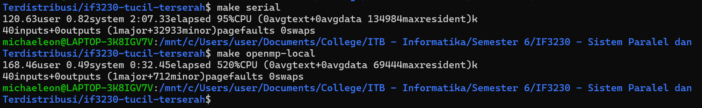
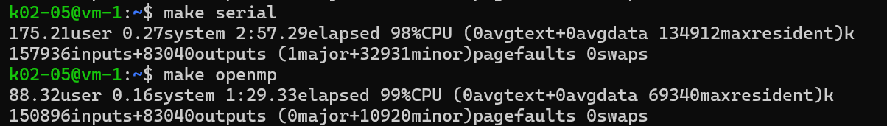

# 🔢📈 Tugas Kecil 2 - Paralel Invers Matrix dengan OpenMP
> Tugas Kecil 2 IF3230 Sistem Paralel dan Terdistribusi, Melakukan Paralelisasi Invers Matrix Metode Gauss-Jordan dengan OpenMP.

## ❓ &nbsp;Apa itu OpenMP?
OpenMP (Open Multi-Processing) adalah sebuah antarmuka pemrograman aplikasi (API) yang mendukung pemrograman multiproses pada sistem *shared memory*. OpenMP dirancang untuk membuat pengembangan aplikasi paralel lebih mudah dan lebih efisien dengan menggunakan direktif *preprocessor* dan variabel lingkungan yang bekerja bersama untuk membangun blok bangunan dasar paralelisme dalam kode. OpenMP memungkinkan pengembang untuk menulis kode yang dapat dijalankan secara paralel pada berbagai inti prosesor secara bersamaan. Dengan demikian, aplikasi dapat memanfaatkan potensi penuh dari arsitektur multiprosesor, meningkatkan kinerja aplikasi secara signifikan. Sebagai sebuah kerangka kerja yang luas digunakan dalam berbagai aplikasi komputasi, OpenMP telah terbukti efektif dalam menyederhanakan proses pengembangan aplikasi paralel, yang pada gilirannya meningkatkan produktivitas dan efisiensi pengembangan perangkat lunak.

## 🤔 &nbsp;Bagaimana Implementasinya dalam Invers Matrix?
Prosedur paralelisasi invers matriks berfokus pada penggunaan teknik *partial pivoting* untuk menemukan baris pivot terbaik secara paralel, yang kemudian digunakan untuk menukar baris dan menghasilkan matriks segitiga atas. Langkah-langkah tersebut menggambarkan pendekatan paralel dalam proses pemrosesan matriks, dimulai dari pengalokasian thread untuk mencari baris pivot terbaik secara bersamaan, dilanjutkan dengan penggunaan *critical key* untuk memastikan konsistensi perubahan baris pivot global, hingga tahap akhir, yaitu operasi *back substitution*, juga diterapkan secara paralel. Dengan demikian, pendekatan ini memungkinkan pemrosesan invers matriks yang lebih efisien melalui penggunaan sumber daya komputasi secara bersamaan.

## 💡 &nbsp;Detail Prosedur Implementasi
1. Terima masukan sebuah matriks berukuran $n \times n$ dan inisiasi pula matriks identitas $n \times n$ di sisi kanannya. Hasil akhir yang terbentuk adalah sebuah matriks berukuran $n \times 2n$.
2. Lakukan *partial pivoting* secara paralel. Prosesnya secara detail sebagai berikut.
   - Masing-masing thread mencari baris pivot terbaik dari baris matriks yang dialokasikan (menggunakan *static scheduling* pada for loop).
   - Thread mengupdate baris pivot global jika baris pivot lokal terbaik lebih baik dibanding pivot row global. Proses ini dikunci dengan `#pragma omp critical`.
   - Tunggu hingga semua thread mengecek apakah baris pivotnya merupakan yang terbaik.
   - Tukar baris pivot dan baris yang sedang diiterasi (baris ke- $i$) jika keduanya tidak sama. Proses ini juga diparalelisasi ke semua thread.
   - Ubah matriks menjadi matriks segitiga atas secara paralel.
3. Lakukan *back substitution* secara paralel. Prosesnya secara detail sebagai berikut.
   - Bagi seluruh isi baris yang sedang diiterasi (baris ke- $i$) dengan *leading coefficient*-nya.
   - Kurangi semua baris lain dengan hasil perkalian baris $i$ secara paralel.

## 🔍 &nbsp;Analisis Implementasi Solusi
Dalam implementasi algoritma paralel untuk invers matriks dengan *shared memory*, fokus utamanya adalah pada peningkatan efisiensi melalui pembagian beban kerja di antara thread-thread yang berbagi memori. Dalam tahap *partial pivoting*, setiap thread bertanggung jawab untuk mencari baris pivot terbaik dalam bagian matriks yang mereka alokasikan. Penggunaan *shared memory* memungkinkan setiap thread untuk dengan cepat mengakses dan memperbarui data matriks tanpa perlu saling berkirim pesan, sehingga mengurangi overhead komunikasi. Ketika baris pivot terbaik telah ditemukan, thread-thread berkoordinasi  untuk memastikan konsistensi perubahan baris pivot global. Kemudian, dalam tahap *back substitution*, operasi dilakukan secara paralel dengan setiap thread bertanggung jawab untuk memproses baris matriks secara bersamaan. Dengan memanfaatkan *shared memory*, data matriks yang telah diubah dapat diakses dan dimodifikasi secara efisien oleh semua thread, memungkinkan proses *back substitution* berjalan dengan cepat tanpa memerlukan overhead komunikasi yang signifikan. Dengan demikian, implementasi algoritma invers matriks secara paralel ini memungkinkan **pemrosesan yang efisien dan efektif**, meningkatkan kinerja keseluruhan program dengan **meminimalkan latensi akses memori dan overhead komunikasi** antar thread.

## 📸 &nbsp;Dokumentasi Hasil Eksekusi
Hasil ekesekusi lokal  (*data atas menggunakan serial dan data bawah menggunakan OpenMP*).

Hasil ekekusi menggunakan server.

Secara umum diperoleh *speed-up* hingga $4 \times$ lipat! 🤩
