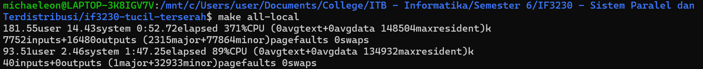
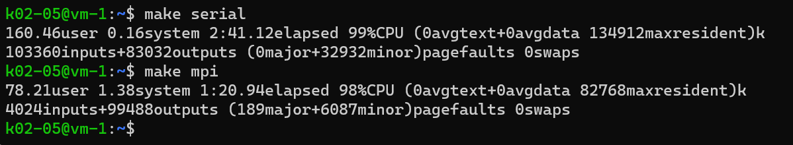

# 🔢📈 Tugas Kecil 1 - Paralel Invers Matrix dengan OpenMPI
> Tugas Kecil IF3230 Sistem Paralel dan Terdistribusi, Melakukan Paralelisasi Invers Matrix Metode Gauss-Jordan dengan Open MPI.

## ❓ &nbsp;Apa itu Open MPI?
Open MPI (Open Message Passing Interface) adalah sebuah implementasi dari standar MPI (*Message Passing Interface*) yang digunakan untuk komunikasi paralel dan pemrograman pada sistem komputer yang terdiri dari banyak prosesor. Open MPI menyediakan perangkat lunak dan alat untuk membangun dan menjalankan aplikasi paralel, memungkinkan proses-proses yang berjalan secara bersamaan untuk berkomunikasi dan berkoordinasi dalam rangka menyelesaikan tugas yang kompleks secara efisien pada sistem komputer terdistribusi dan terdapat dalam sumber terbuka yang dapat diakses oleh siapa saja untuk pengembangan dan penggunaan.

## 🤔 &nbsp;Bagaimana Implementasinya dalam Invers Matrix?
Proses dimulai dengan penerimaan matriks input, di mana setiap proses akan memperoleh bagian dari matriks tersebut. Setiap proses kemudian mencari baris pivot terbaik dari bagian matriks yang diterimanya dan mengirimkan informasi ini ke proses induk. Proses induk, dalam kasus ini proses $0$, akan memilih pivot terbaik dari seluruh informasi yang diterima, dan kemudian membagi baris pivot dengan *leading coefficient*-nya sebelum mengirimkan hasilnya kembali ke semua proses. Selanjutnya, setiap proses akan menyesuaikan matriksnya dengan baris pivot yang sudah dibagi dan mengurangi nilai-nilai non-diagonal pada kolom yang sesuai. Setelah semua baris diproses, masing-masing proses akan mengirimkan bagian matriks yang dimilikinya ke proses $0$.

## 💡 &nbsp;Detail Prosedur Implementasi
1. Terima masukan sebuah matriks berukuran $n \times n$ dan inisiasi pula matriks identitas $n \times n$ di sisi kanannya. Hasil akhir yang terbentuk adalah sebuah matriks berukuran $n \times 2n$.
2. Bagi baris-baris dari matriks yang terbentuk ke seluruh proses yang ada secara merata.
3. Selanjutnya, untuk tiap baris $i$ pada matriks :
    - Setiap proses akan mencari baris pivot terbaik dari semua baris yang dimilikinya.
    - Kirimkan pivot terbaik tersebut ke proses induk (dalam kasus ini proses $0$).
    - Lalu, proses $0$ mencari pivot terbaik dari keseluruhan calon pivot yang diterima.
    - Bagi baris pivot dengan *leading coefficient*-nya, kemudian kirimkan baris pivot yang sudah dibagi ke seluruh proses kembali.
    - Tukar baris pivot dengan baris $i$ jika tidak sama.
    - Setiap proses mengurangi baris yang dimilikinya dengan hasil perkalian baris pivot sehingga semua nilai non-diagonal pada kolom $i$ menjadi $0$.
4. Setelah seluruh baris selesai diproses, masing-masing proses mengirimkan baris yang dimiliki kembali ke proses induk.

## 🔍 &nbsp;Analisis Implementasi Solusi
Program ini menggunakan metode pembagian data antar-proses, di mana matriks input dibagi secara merata di antara proses-proses yang ada. Pendekatan ini dipilih karena **memungkinkan pemanfaatan sumber daya secara efisien** pada sistem terdistribusi, dengan memungkinkan proses-proses untuk bekerja secara paralel pada bagian-bagian matriks yang berbeda. Hal ini juga membuat **setiap proses tidak memproses keseluruhan matriks** yang membuat paralelisasi berjalan kurang optimal. Dengan demikian, setiap proses dapat fokus pada tugas yang diberikan tanpa perlu saling menunggu. Selain itu, dengan menggunakan skema pembagian data antar-proses, dapat **meminimalkan overhead komunikasi antar-proses** karena masing-masing proses hanya bertanggung jawab untuk memproses data yang diterimanya, tanpa perlu terlalu sering berkomunikasi dengan proses lain. Komunikasi hanya dilakukan saat "mengembalikan" nilai kalkulasi ke proses induk. Hal ini menghasilkan **kinerja yang lebih baik** dalam pemrosesan paralel invers matriks, terutama pada sistem yang memiliki banyak prosesor atau core.

## 📸 &nbsp;Dokumentasi Hasil Eksekusi
Hasil ekesekusi lokal  (*data atas menggunakan openMPi dan data bawah menggunakan serial*).

Hasil ekekusi menggunakan server.

Secara umum diperoleh speedup hingga $2 \times$ lipat! 🤩
